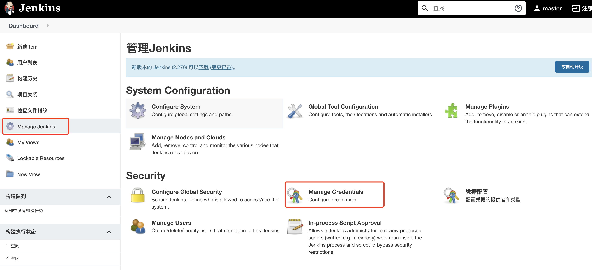
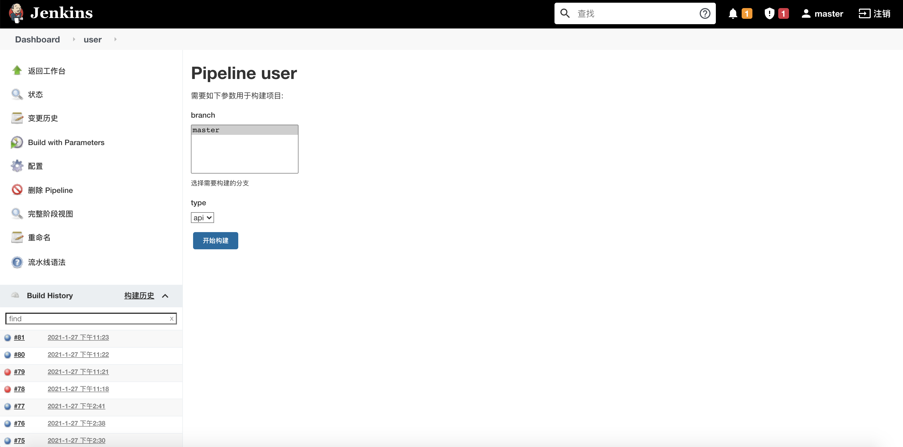

# Service Deployment
> [!TIP]
> This document is machine-translated by Google. If you find grammatical and semantic errors, and the document description is not clear, please [PR](doc-contibute.md)

This section uses jenkins to demonstrate a simple service deployment to k8s.

## Prepare
* k8s cluster installation
* gitlab environment installation
* jenkins environment installation
* redis&mysql&nginx&etcd installation
* [goctl install](goctl-install.md)

> [!TIP]
> Ensure that goctl is installed on each node of k8s
> 
> Please google for the installation of the above environment, and I will not introduce it here.

## Service deployment
### 1、Relevant preparations for gitlab code warehouse

#### 1.1、Add SSH Key

Enter gitlab, click on the user center, find `Settings`, find the `SSH Keys` tab on the left


* 1、View the public key on the machine where jenkins is located

```shell
$ cat ~/.ssh/id_rsa.pub
```

* 2、If not, you need to generate it, if it exists, please skip to step 3

```shell
$ ssh-keygen -t rsa -b 2048 -C "email@example.com"
```

> "email@example.com" 可以替换为自己的邮箱
>
After completing the generation, repeat the first step

* 3、Add the public key to gitlab

#### 1.2、Upload the code to the gitlab warehouse
Create a new project `go-zero-demo` and upload the code. Details are not described here.

### 2、jenkins

#### 2.1、Add credentials

* View the private key of the machine where Jenkins is located, which corresponds to the previous gitlab public key

```shell
$ cat id_rsa
```

* Enter jenkins, click on `Manage Jenkins`-> `Manage Credentials`
  

* Go to the `Global Credentials` page, add credentials, `Username` is an identifier, add pipeline later, you know that this identifier represents the credentials of gitlab, and Private Key` is the private key obtained above
  

#### 2.2、 Add global variables
Enter `Manage Jenkins`->`Configure System`, slide to the entry of `Global Properties`, add docker private warehouse related information, as shown in the figure is `docker username`, `docker user password`, `docker private warehouse address`

> [!TIP]
> The private warehouse I use here, if you don’t use the private warehouse provided by the cloud vendor, you can build a private warehouse yourself. I won’t go into details here, and you can google it yourself.

#### 2.3、Configure git
Go to `Manage Jenkins`->`Global Tool Configureation`, find the Git entry, fill in the path of the git executable file of the machine where jenkins is located, if not, you need to download the Git plugin in the jenkins plugin management.


#### 2.4、 Add a pipeline

> The pipeline is used to build the project, pull code from gitlab->generate Dockerfile->deploy to k8s are all done in this step, here is the demo environment, in order to ensure the smooth deployment process,
> Need to install jenkins on the machine where one of the nodes of the k8s cluster is located, I installed it on the master here.

* Get the credential id Go to the credential page and find the credential id whose Username is `gitlab`
  

* Go to the jenkins homepage, click on `New Item`, the name is `user`
  

* View project git address
  

* Add the service type Choice Parameter, check `This project is parameterized in General`,
  Click `Add parameter` and select `Choice Parameter`, add the selected value constant (api, rpc) and the variable (type) of the received value according to the figure, which will be used in the Pipeline script later.
  

* Configure `user`, on the `user` configuration page, swipe down to find `Pipeline script`, fill in the script content

```text
pipeline {
  agent any
  parameters {
      gitParameter name: 'branch', 
      type: 'PT_BRANCH',
      branchFilter: 'origin/(.*)',
      defaultValue: 'master',
      selectedValue: 'DEFAULT',
      sortMode: 'ASCENDING_SMART',
      description: 'Select the branch'
  }

  stages {
      stage('service info')    {
          steps {
              sh 'echo branch: $branch'
              sh 'echo build service type：${JOB_NAME}-$type'
          }
      }


      stage('check out') {
          steps {
              checkout([$class: 'GitSCM', 
              branches: [[name: '$branch']],
              doGenerateSubmoduleConfigurations: false, 
              extensions: [], 
              submoduleCfg: [],
              userRemoteConfigs: [[credentialsId: '${credentialsId}', url: '${gitUrl}']]])
          }   
      }

      stage('get commit_id') {
          steps {
              echo 'get commit_id'
              git credentialsId: '${credentialsId}', url: '${gitUrl}'
              script {
                  env.commit_id = sh(returnStdout: true, script: 'git rev-parse --short HEAD').trim()
              }
          }
      }


      stage('goctl version detection') {
          steps{
              sh '/usr/local/bin/goctl -v'
          }
      }

      stage('Dockerfile Build') {
          steps{
                 sh '/usr/local/bin/goctl docker -go service/${JOB_NAME}/${type}/${JOB_NAME}.go'
                 script{
                     env.image = sh(returnStdout: true, script: 'echo ${JOB_NAME}-${type}:${commit_id}').trim()
                 }
                 sh 'echo image：${image}'
                 sh 'docker build -t ${image} .'
          }
      }

      stage('Upload to the mirror warehouse') {
          steps{
              sh '/root/dockerlogin.sh'
              sh 'docker tag  ${image} ${dockerServer}/${image}'
              sh 'docker push ${dockerServer}/${image}'
          }
      }

      stage('Deploy to k8s') {
          steps{
              script{
                  env.deployYaml = sh(returnStdout: true, script: 'echo ${JOB_NAME}-${type}-deploy.yaml').trim()
                  env.port=sh(returnStdout: true, script: '/root/port.sh ${JOB_NAME}-${type}').trim()
              }

              sh 'echo ${port}'

              sh 'rm -f ${deployYaml}'
              sh '/usr/local/bin/goctl kube deploy -secret dockersecret -replicas 2 -nodePort 3${port} -requestCpu 200 -requestMem 50 -limitCpu 300 -limitMem 100 -name ${JOB_NAME}-${type} -namespace hey-go-zero -image ${dockerServer}/${image} -o ${deployYaml} -port ${port}'
              sh '/usr/bin/kubectl apply -f ${deployYaml}'
          }
      }
      
      stage('Clean') {
          steps{
              sh 'docker rmi -f ${image}'
              sh 'docker rmi -f ${dockerServer}/${image}'
              cleanWs notFailBuild: true
          }
      }
  }
}
```

> [!TIP]
> ${credentialsId} should be replaced with your specific credential value, that is, a string of strings in the [Add Credentials] module, ${gitUrl} needs to be replaced with the git warehouse address of your code, other variables in the form of ${xxx} are not required Modify it and keep it as it is.
> 


The content of dockerlogin.sh

```shell
#!/bin/bash
docker login --username=$docker-user --password=$docker-pass $docker-server
```

* $docker-user: docker login username
* $docker-pass: docker login user password
* $docker-server: docker private address

## View pipeline



## View k8s service


# Guess you wants
* [Goctl Installation](goctl-install.md)
* [k8s](https://kubernetes.io/)
* [docker](https://www.docker.com/)
* [jenkins](https://www.jenkins.io/zh/doc/book/installing/)
* [jenkins pipeline](https://www.jenkins.io/zh/doc/pipeline/tour/hello-world/)
* [nginx](http://nginx.org/en/docs/)
* [etcd](https://etcd.io/docs/current/)